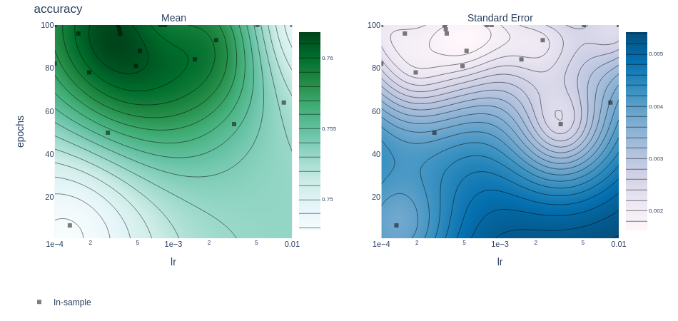
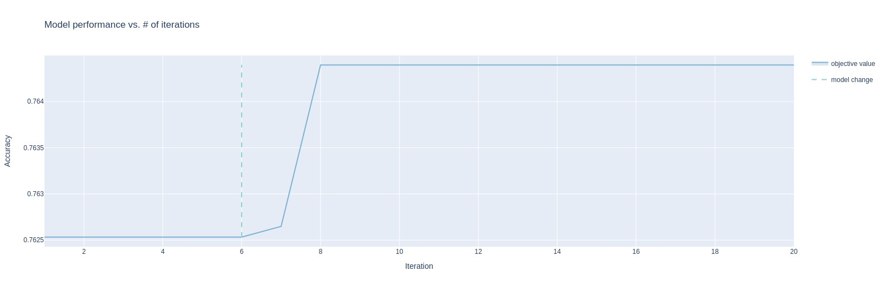

# PROTIEN STRUCTURE PREDICTION

#### Predicting Protein Secondary Structure using a Fully Convolutional Network

## OBJECTIVE

The overall goal is to write a Fully Convolutional PyTorch model that can input protein sequence data (often called the Protein Primary Structure), or additionally using PSSM Profiles to predict the protein secondary structure (H = Helix, E = Extended Sheet, C = Coil symbols). The PDB Database contains the protein structures of over 200,000 proteins. Each has a unique PDB_ID code such as 1A0S (the first one in the training data) which is the structure shown above (sucrose-specific porin of salmonella) which is used to transfer sucrose across the cell membrane of salmonella bacteria which causes food poisoning. The protein has a 3D Structure which shows that most of this protein is extended beta sheet (flat arrows) and coil (random lines).

## MEAN AND STANDARD DEVIATION

- It specifies the parameters lr (learning rate) and epochs on the X and Y axes, respectively, and the accuracy metric to be plotted.

## OPTIMIZATION TRACE

- The optimization trace typically includes information about the iterations of an optimization process, such as parameter values tested and corresponding objective function values.

